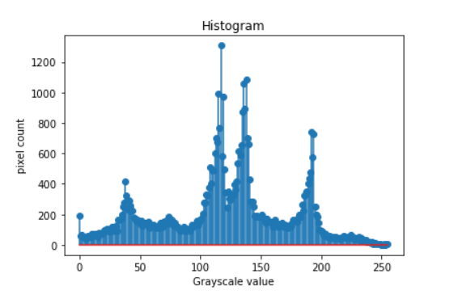

# Histogram and Histogram Equalization of an image
## Aim
To obtain a histogram for finding the frequency of pixels in an Image with pixel values ranging from 0 to 255. Also write the code using OpenCV to perform histogram equalization.

## Software Required:
Anaconda - Python 3.7

## Algorithm:
### Step1:
Import cv2 and matplotlib.pyplot packages.
<br>

### Step2:
Read the images using imread()function.
<br>

### Step3:
Using cv2.calcHist find Histogram of the images.
<br>

### Step4:
Using cv2.equalizeHist find Equalization of Histogram.
<br>

### Step5:
Run the program and execute the output.
<br>
<br></br>
<br></br>
<br></br>
<br></br>
<br></br>
## Program:
```python
# Developed By: K.Balaji
# Register Number: 212221230011
import cv2
import matplotlib.pyplot as plt

# Write your code to find the histogram of gray scale image , color image channels and display the histogram of gray scale image and any one channel histogram from color image
import cv2
import matplotlib.pyplot as plt
gray_image=cv2.imread('grayimage.jpg')
color_image=cv2.imread('colorimage.jpg')
hist=cv2.calcHist([gray_image],[0],None,[256],[0,256])
hist1=cv2.calcHist([color_image],[1],None,[256],[0,256])
plt.imshow(gray_image)
plt.show()
plt.imshow(color_image)
plt.show()
plt.figure()
plt.title("Histogram")
plt.xlabel('Grayscale value')
plt.ylabel('pixel count')
plt.stem(hist)
plt.show()
plt.title('Histogram of color image - Green channel')
plt.xlabel('Intensity value')
plt.ylabel('pixel count')
plt.stem(hist1)
plt.show()


# Write the code to perform histogram equalization of the image. 
import cv2
g=cv2.imread('DHONI1.jpg',0)
cv2.imshow('gray scale image',g)
equ = cv2.equalizeHist(g)
cv2.imshow('Equalized image',equ)
cv2.waitKey(0)
cv2.destroyAllWindows()


```
<br></br>
<br></br>
<br></br>
<br></br>
<br></br>
<br></br>
## Output:
### Input Grayscale Image and Color Image


<br></br>
<br></br>
<br></br>
<br></br>
<br></br>
<br></br>
<br></br>
<br></br>
<br></br>
<br></br>
<br></br>
<br></br>
<br></br>
<br></br>
<br></br>
<br></br>
### Histogram of Grayscale Image and any channel of Color Image



<br></br>
<br></br>
<br></br>
<br></br>
<br></br>
<br></br>
<br></br>
### Histogram Equalization of Grayscale Image


## Result: 
Thus the histogram for finding the frequency of pixels in an image with pixel values ranging from 0 to 255 is obtained. Also,histogram equalization is done for the gray scale image using OpenCV.
